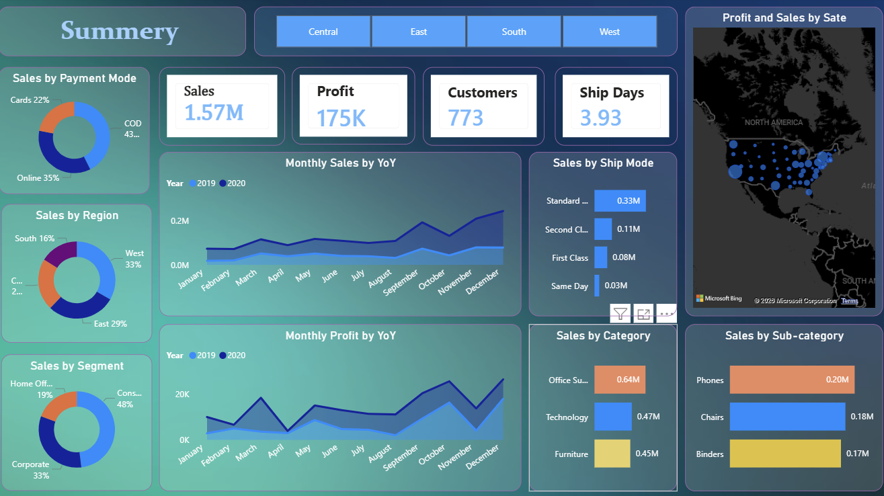
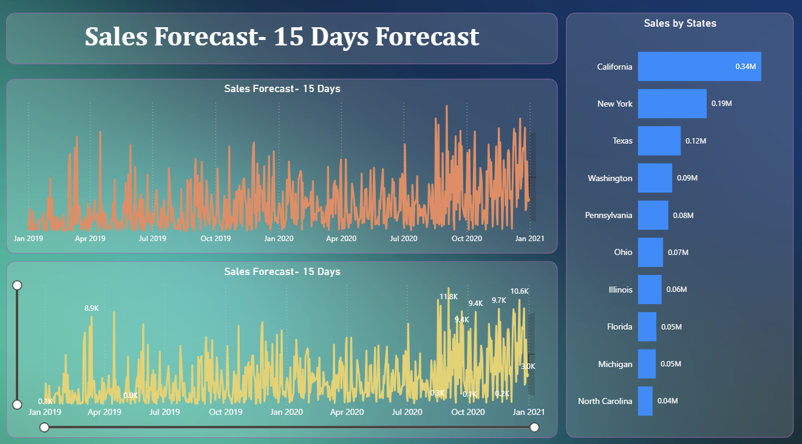

# US-Sales-Analytics-Dashboard

## Project Overview
This Power BI dashboard provides insights into US sales performance through interactive visualizations and KPI tracking.

## Dashboard Pages

### Executive Summary
- Total Sales
- Total Profit
- Orders Analysis
- Key Performance Indicators

### Product Intelligence Center
- Top Products
- Product Category Analysis
- Product Performance Metrics

### Regional Performance Hub
- Regional Sales Analysis
- State-wise Performance
- Geographic Insights

### Forecast Analysis
- Sales Forecasting
- Trend Analysis
- Future Performance Prediction

## Tools Used
- Power BI
- DAX
- Power Query
- Excel

## Dataset
US Sales Dataset

## Project Screenshots

### Executive Summary

### Product Intelligence Center

### Regional Performance Hub

### Forecast

## Author
Gaurav Rajput
